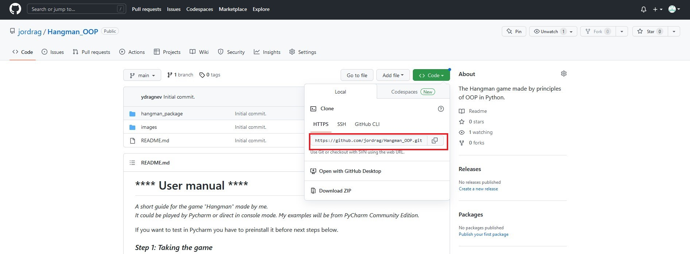
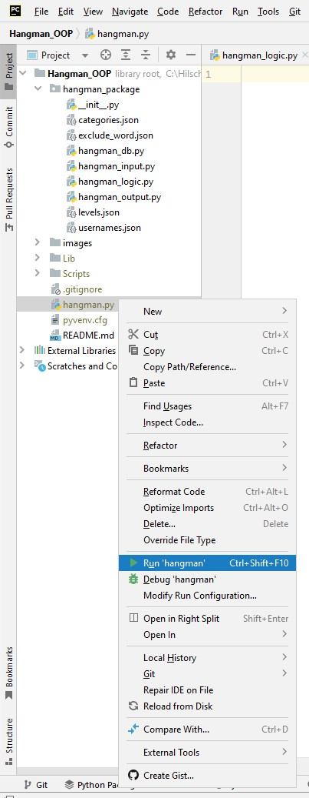
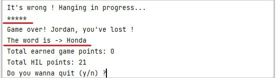

# 
 **** User manual **** 

*A short guide for the game "Hangman" made by me.\
It could be played by Pycharm or direct in console mode.
My examples will be from PyCharm Community Edition.*

If you want to test in Pycharm you have to preinstall it before next steps below.

### *Step 1: Taking the game*

 1. You can download the game from this [repository page](https://github.com/jordrag/Exercises/tree/main/hangman).
The easiest way is to clone it following the instructions.

 2. First copy the link marked in red rectangle on the picture

 3. Open Pycharm

 4. Go to "Get from VCS"

 

 5. Paste the link copied before in the URL field and choose the directory where to clone on your computer, after that click on Clone

 

### *Step 2: Playing the game*

1. **After the repository has been cloned, run "hangman.py" with right click on it in the Project menu** 

2. **At the start screen fill in your username, difficulty and level**

 

3. **On the next screen you'll see your initial data: username wtih HIL points earned from all previous played games and the starting Game points for this game. \
They depend on the length of the current word and the rules for them are:**
   * Each wrong guess will subtract 1 from the max score
   * Each hint used will subtract 2 from the max score and the last chance to take a hint is when you have 2 points left
   * The score cannot be negative so if you reach 0 game points the game ends

 

4. **There is one magic symbol **"@"** for entering in submenu where you can choose from some additional options**
    
    
    
    * **The first one is "Hint" (1). The game gives you a random letter from the word.**
     
    
   
    The circled stars are your wrong guessed letters from the word. Their maximum number is the length of the word and increased with each wrong answer in opposition of the Game points.
    * **The second option is multiple choice: (2) to quit the game, change category or level**
     
    
    
    * **If you feel lucky or very clever you can choose the third option: (3) guess the whole word. You can type it with first capital or only smallcaps.**
     
    
    
    And if you guess it you win 1 HIL point and can choose to play again or to quit.
     
    
    
    * **In every single moment of the game you can show a list of all your asked letters (4)**
     
    
    
    * **If you have too many letters more to guess but have no more lives you can exchange 10 HIL points (if you have them) for one more try in the fifth option (5)**
     
    
     
    
    
5. **If you choose to leave the game from (2) your HIL points are saved to the database and next time you play with this username the game will begin with them.**
     
6. **If you hang on the rope (loose the game), you'll see the right word, your current HIL points and if you want, you can quit the game.**
     
    
    
# 
 **** Enjoy the game !!! ****
